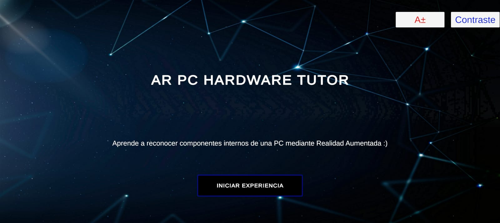
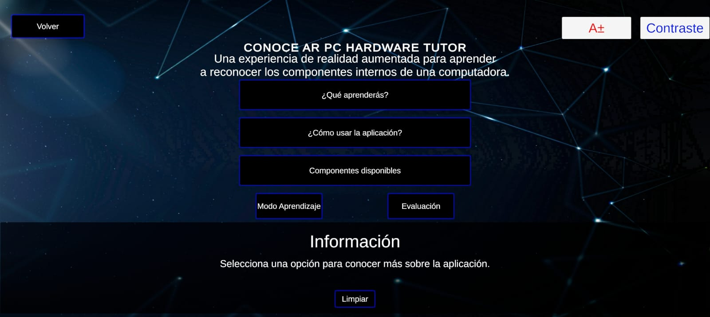
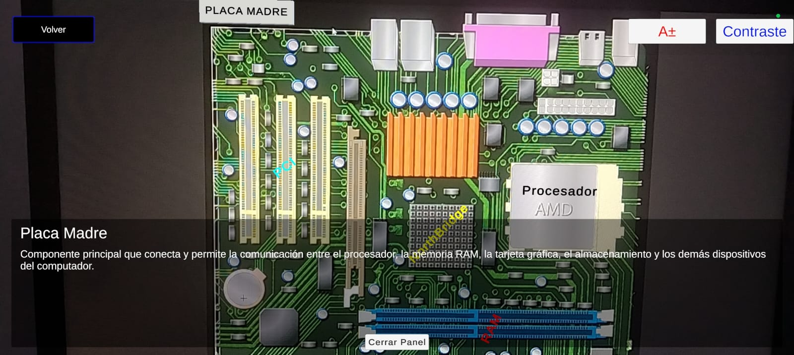
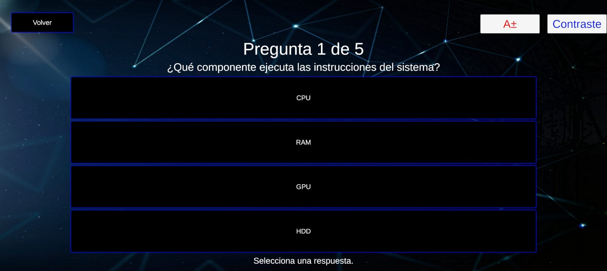
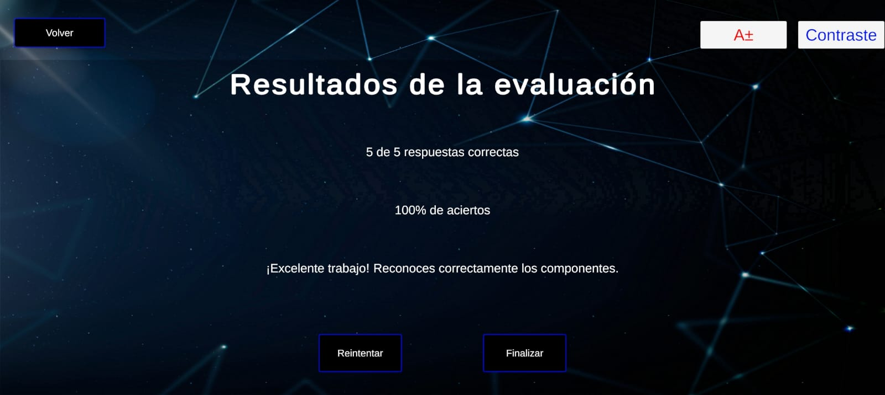
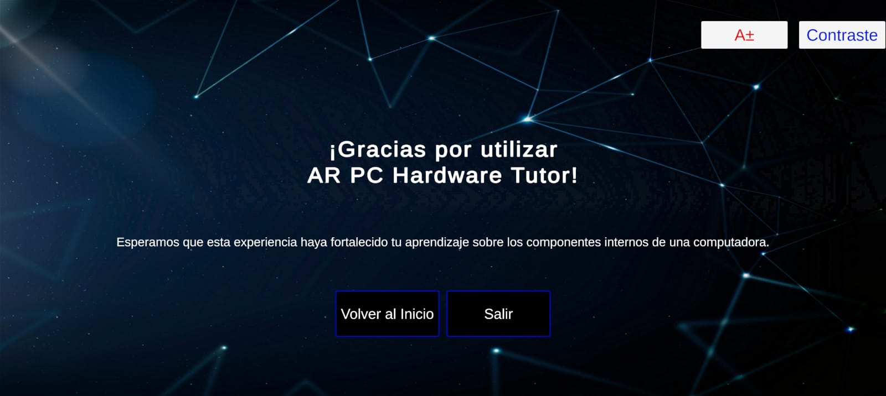

# Tutor de Hardware PC en Realidad Aumentada

## Proyecto del curso PSISP08075 — Realidad Virtual y Aumentada

**Universidad Autónoma del Perú | Ingeniería de Sistemas | 2026-1**

---

## Descripción técnica

**AR PC Hardware Tutor** es una aplicación educativa desarrollada con Unity, C# y Vuforia Engine que utiliza realidad aumentada para apoyar el aprendizaje de los principales componentes internos de una computadora. Mediante el reconocimiento de Image Targets, la aplicación identifica imágenes relacionadas con la placa madre, CPU, memoria RAM, GPU y disco duro, y presenta información sobre sus funciones. El sistema también incorpora interacción táctil, opciones de accesibilidad visual y un módulo de evaluación con preguntas, retroalimentación y puntaje final. La aplicación está orientada a dispositivos Android y almacena localmente los resultados y preferencias mediante `PlayerPrefs`.

| Campo | Detalle |
|---|---|
| **Tipo XR** | Realidad Aumentada |
| **Motor de desarrollo** | Unity 2022.3.62f1 |
| **Tecnología AR** | Vuforia Engine e Image Targets |
| **Lenguaje** | C# |
| **Plataforma** | Android |
| **Curso** | PSISP08075 — Realidad Virtual y Aumentada |
| **Semestre** | 2026-1 |

---

## Objetivo del proyecto

Desarrollar una aplicación educativa de realidad aumentada que permita reconocer componentes internos de una computadora y facilite su aprendizaje mediante contenido interactivo, navegación intuitiva, funciones de accesibilidad y un módulo de evaluación.

---

## Integrantes

| Integrante | Código | Rol en el proyecto |
|---|---:|---|
| Salazar Mondragón Jael Santiago | 2221898131 | Líder del proyecto, desarrollo en Unity, realidad aumentada y pruebas |
| Palacios Vergaray Jhener Erick | 2231890156 | Desarrollo en Unity, documentación y pruebas |

---

## Funcionalidades implementadas

### Modo aprendizaje

- Reconocimiento de Image Targets mediante Vuforia Engine.
- Reconocimiento de cinco componentes:
  - Placa madre.
  - Procesador o CPU.
  - Memoria RAM.
  - Tarjeta gráfica o GPU.
  - Disco duro o HDD.
- Indicador táctil para consultar información.
- Panel dinámico con el nombre y la descripción del componente.
- Ocultamiento del contenido cuando se pierde el marcador.
- Interacción táctil mediante Unity Input System.

### Módulo de evaluación

- Cuestionario de selección múltiple.
- Cinco preguntas relacionadas con los componentes estudiados.
- Validación de respuestas correctas e incorrectas.
- Retroalimentación inmediata.
- Cálculo automático del puntaje.
- Pantalla de resultados.
- Almacenamiento local del resultado mediante `PlayerPrefs`.

### Accesibilidad

- Opción para aumentar el tamaño del texto.
- Modo de alto contraste.
- Persistencia de las preferencias entre escenas.
- Botones de accesibilidad disponibles durante la navegación.

### Navegación

La aplicación cuenta con las siguientes escenas:

- `MenuScene`
- `ExpoScene`
- `ARScene`
- `EvaluationScene`
- `ResultsScene`
- `ThanksScene`

---

## Tecnologías utilizadas

- Unity 2022.3.62f1.
- Vuforia Engine.
- Unity Input System.
- TextMeshPro.
- C#.
- Android Build Support.
- Visual Studio o Visual Studio Code.
- Git y GitHub.

---

# Instalación y ejecución

## Requisitos

Para abrir, ejecutar y compilar el proyecto se requiere:

- Unity Hub.
- Unity Editor 2022.3.62f1.
- Módulo Android Build Support.
- Android SDK y NDK.
- OpenJDK.
- Vuforia Engine instalado en el proyecto.
- Dispositivo Android con cámara.
- Cable USB para realizar `Build and Run`.
- Depuración USB activada en el dispositivo.
- Git, en caso de clonar el repositorio desde la terminal.

---

## 1. Clonar el repositorio

Abrir PowerShell, Git Bash o la terminal de Visual Studio Code y ejecutar:

```bash
git clone https://github.com/RubenCarty/AR-VR-g03-tutor-hardware-ra.git
cd AR-VR-g03-tutor-hardware-ra
```

---

## 2. Agregar el proyecto a Unity Hub

1. Abrir **Unity Hub**.
2. Seleccionar **Add** o **Add project from disk**.
3. Buscar la carpeta clonada del repositorio.
4. Seleccionar la carpeta principal que contiene:
   - `Assets`
   - `Packages`
   - `ProjectSettings`
5. Abrir el proyecto con **Unity 2022.3.62f1**.
6. Esperar a que Unity importe y compile todos los recursos.

---

## 3. Verificar la configuración del proyecto

1. Ir a **File → Build Settings**.
2. Seleccionar la plataforma **Android**.
3. Presionar **Switch Platform** si Android todavía no está activo.
4. Verificar que las escenas se encuentren agregadas en este orden:

```text
0. MenuScene
1. ExpoScene
2. ARScene
3. EvaluationScene
4. ResultsScene
5. ThanksScene
```

5. Verificar que no existan errores rojos en la ventana **Console**.
6. Comprobar que Vuforia Engine se encuentre habilitado.
7. Confirmar que la licencia y la base de datos de Image Targets estén configuradas.

---

## 4. Ejecutar dentro de Unity

1. Abrir la escena `MenuScene`.
2. Presionar el botón **Play**.
3. Verificar la navegación entre las escenas.
4. Para probar el reconocimiento real de Vuforia, ejecutar la aplicación en un dispositivo Android.

---

## 5. Ejecutar en un dispositivo Android

1. Activar las **Opciones de desarrollador** en el celular.
2. Activar **Depuración USB**.
3. Conectar el dispositivo a la computadora mediante USB.
4. Aceptar la autorización de depuración cuando aparezca en el celular.
5. En Unity, ir a **File → Build Settings**.
6. Seleccionar **Android**.
7. Seleccionar el dispositivo en **Run Device**.
8. Presionar **Build and Run**.
9. Elegir una carpeta para guardar el archivo APK.
10. Esperar a que Unity compile, instale y ejecute la aplicación.
11. Enfocar con la cámara uno de los Image Targets registrados.
12. Pulsar el indicador mostrado para consultar la información del componente.

---

# Arquitectura del sistema

La aplicación se organiza en cuatro capas principales:

```text
Capa de presentación
├── Escenas Unity
├── Canvas UI
├── TextMeshPro
├── Paneles informativos
└── Funciones de accesibilidad

Capa de lógica
├── ARInteractionController
├── InfoPanelController
├── QuizManager
├── ResultsManager
├── GestorAccesibilidadVisual
├── ExpoPanelController
└── SceneLoader

Capa de reconocimiento AR
├── Vuforia Engine
├── ARCamera
└── Image Targets

Capa de almacenamiento local
└── PlayerPrefs
    ├── Puntaje de evaluación
    ├── Total de preguntas
    ├── Texto grande
    └── Alto contraste
```

La explicación completa se encuentra en:

[Consultar arquitectura técnica](docs/arquitectura.md)

---

## Flujo de escenas

```text
MenuScene
    │
    ▼
ExpoScene
    ├─────────────────────────┐
    │                         │
    ▼                         ▼
ARScene                 EvaluationScene
                              │
                              ▼
                         ResultsScene
                              │
                              ▼
                         ThanksScene
                              │
                              ▼
                          MenuScene
```

---

## Jerarquía principal de ARScene

```text
ARScene
├── ARCamera
├── ImageTarget_RAM
├── ImageTarget_CPU
├── ImageTarget_GPU
├── ImageTarget_HDD
├── ImageTarget_Motherboard
├── Canvas
│   ├── Botón volver
│   ├── Indicador de toque
│   ├── Panel informativo
│   └── Panel de accesibilidad
├── ARInteractionManager
│   └── ARInteractionController.cs
├── InfoPanelController
│   └── InfoPanelController.cs
├── GestorAccesibilidad
│   └── GestorAccesibilidadVisual.cs
└── SceneLoader
    └── SceneLoader.cs
```

---

## Scripts principales

| Script | Responsabilidad |
|---|---|
| `ARInteractionController.cs` | Gestiona el componente reconocido y la interacción táctil. |
| `InfoPanelController.cs` | Actualiza el título y la descripción del panel informativo. |
| `QuizManager.cs` | Administra preguntas, alternativas, retroalimentación y puntaje. |
| `ResultsManager.cs` | Recupera y presenta el resultado final de la evaluación. |
| `GestorAccesibilidadVisual.cs` | Controla el texto grande, el alto contraste y su persistencia. |
| `ExpoPanelController.cs` | Actualiza el contenido informativo de `ExpoScene`. |
| `SceneLoader.cs` | Controla el cambio entre las escenas de la aplicación. |

---

# Capturas del prototipo

## Menú principal



## Escena de exposición



## Modo de aprendizaje en realidad aumentada



## Módulo de evaluación



## Pantalla de resultados



## Pantalla de agradecimiento



---

# Video demo

El video demuestra el flujo completo de la aplicación, el reconocimiento de componentes, el panel informativo, las funciones de accesibilidad y el módulo de evaluación.

**Enlace del video:** [Ver video demostrativo](https://youtu.be/WMwHr9wUSY4?si=IzVLGEN8PTkVhECL)


---

# Pruebas realizadas

Se prepararon y ejecutaron pruebas funcionales sobre la navegación, el reconocimiento de componentes, la interacción táctil, la accesibilidad, el cuestionario y la presentación de resultados.

| Métrica | Resultado |
|---|---:|
| Casos de prueba ejecutados | 8 |
| Casos de prueba aprobados | 8 |
| Componentes reconocidos | 5 |
| Bugs documentados | 5 |
| Bugs cerrados | 5 |
| FPS promedio | 78 |
| Dispositivo de prueba | Honor X8b |
| Sistema operativo | Android |

Documentos relacionados:

- [Plan de pruebas](PLAN_PRUEBAS.md)
- [Registro de bugs](docs/BUGS.md)
- [Checklist de avance semanal](docs/avance_semanal.md)

---

## Bugs corregidos

Durante el desarrollo se identificaron y resolvieron problemas relacionados con:

- Visualización incorrecta de la información del componente.
- Configuración de las respuestas del cuestionario.
- Distribución de elementos dentro de los Layout Groups.
- Deformación de botones al aumentar el texto.
- Comportamiento del seguimiento de los Image Targets.

Todos los bugs documentados se encuentran en estado **CERRADO**.

---

# Estructura del repositorio

```text
AR-VR-g03-tutor-hardware-ra/
├── Assets/
│   ├── Scenes/
│   ├── Scripts/
│   ├── Prefabs/
│   ├── Materials/
│   ├── Images/
│   ├── TextMesh Pro/
│   └── Vuforia/
├── Packages/
├── ProjectSettings/
├── docs/
│   ├── capturas/
│   │   ├── MenuScene.jpeg
│   │   ├── ExpoScene.jpeg
│   │   ├── ARScene.jpeg
│   │   ├── EvaluationScene.jpeg
│   │   ├── ResultsScene.jpeg
│   │   └── ThanksScene.jpeg
│   ├── arquitectura.md
│   ├── avance_semanal.md
│   └── BUGS.md
├── PLAN_PRUEBAS.md
├── README.md
└── .gitignore
```

---

# Estado del proyecto

Actualmente, la aplicación cuenta con:

- Reconocimiento funcional de cinco componentes.
- Modo educativo de realidad aumentada.
- Interacción táctil mediante Unity Input System.
- Paneles dinámicos de información.
- Módulo de evaluación completo.
- Pantalla de resultados.
- Funciones de accesibilidad.
- Persistencia de preferencias entre escenas.
- Flujo completo de navegación.
- Pruebas funcionales documentadas.
- Bugs identificados y cerrados.
- Ejecución en un dispositivo Android.

---

# Trabajo futuro

Como mejoras posteriores se podrían considerar:

- Incorporar narración o contenido de audio educativo.
- Ampliar la cantidad de componentes reconocidos.
- Agregar más preguntas al cuestionario.
- Registrar un historial de evaluaciones.
- Aplicar pruebas formales de usabilidad con usuarios.
- Optimizar el reconocimiento para diferentes condiciones de iluminación.

---

# Licencia

Proyecto académico desarrollado para el curso **PSISP08075 — Realidad Virtual y Aumentada**.

**Universidad Autónoma del Perú — 2026-1.**
